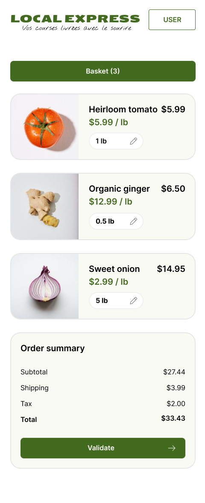

# Cahier des charges

**Société**  localexpress

**Objectif** faire de la livraison de courses à domicile

## Description 

Nous voulons une application web qui permet de commander des produits et de se faire livrer à domicile. Nous ne vendons que quelques produits, qui changent chaque semaine. Il n'est pas nécessaire d'avoir d'historique de commande.

Pour nous démarquer, nous souhaitons :

- Une interface simple, sans navigation. Les produits sont tous sur la même page, simplement rangés par catégories (a-z).
- Compatible smartphone
- Nous privilégions le contact humain
    * paiement à la livraison
    * facture papier (non gérée par l'application)
    * le livreur fera du teasing sur les produits à venir

Nous n'avons pas de contrainte sur la technologie utilisée. Il nous faudra juste un back-office pour gérer les produits et voir les commandes.

## Interface

Voici une idée de l'interface que nous imaginons. Nous ne sommes pas designers, donc n'hésitez pas à nous proposer des améliorations, car nous aimons vos réalisations.

Page d'acceuil :

Page de sélection des produits :

Détail d'un produit :

Finalisation d'une commande :

Commande validée :

## Maquettes et zonage

Page principale :

Version mobile : 

Page produit :

Page produit mobile :

Panier mobile :

## Conception

### User stories

|  En tant que     |  Je veux     |  Afin de     |
|---    |:--    |--    |
|Utilisateur| voir tous les produits disponibles sur une seule page||
|Utilisateur|  ajouter des articles au panier     ||
|Utilisateur|modifier la quantité d'un article dans le panier||
|Utilisateur|supprimer un article du panier||
|Utilisateur|vider le panier||
|Utilisateur|renseigner ses infos de livraison||
|Utilisateur|valider la panier pour commander||
|Administrateur|recevoir les détails des commandes et les informations de livraison|préparer et livrer les courses aux clients|
|Administrateur|ajouter de nouveaux produits dans le back-office|ajouter de nouveaux produits dans le back-office|
|Administrateur|modifier ou supprimer des produits existants|maintenir une liste de produits à jour et pertinente|

### Cas d’utilisation

### Diagramme d’entité-association

### Diagramme de séquence

### Diagramme d’activité

### Diagramme de déploiement

TODO

### Schéma d'architecture

TODO
